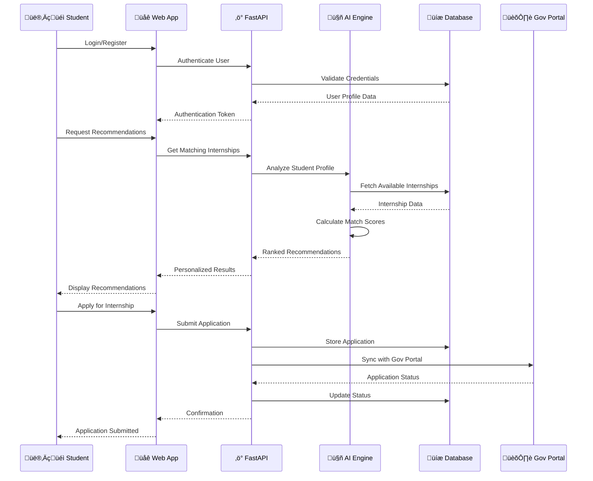
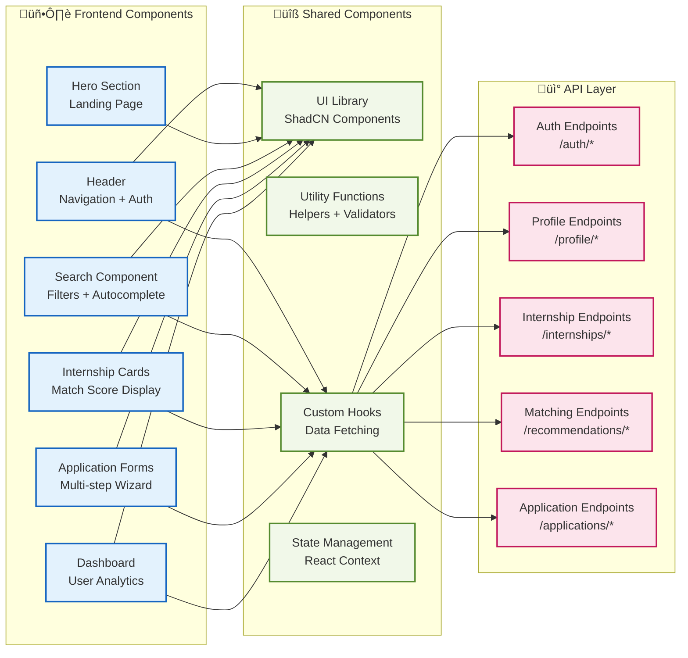

# InternSetu - System Architecture Diagram

```mermaid
graph TB
    %% User Layer
    subgraph "üë• User Interface Layer"
        WEB[Web Application<br/>Next.js 15 + TypeScript]
        MOB[Mobile App<br/>React Native - Future]
        PWA[Progressive Web App<br/>Service Workers]
    end
    
    %% API Gateway
    subgraph "üåê API Gateway & Load Balancer"
        LB[Load Balancer<br/>Nginx/CloudFlare]
        GATE[API Gateway<br/>Rate Limiting + Auth]
    end
    
    %% Application Layer
    subgraph "‚ö° Application Services"
        API[FastAPI Backend<br/>Python 3.11+]
        AUTH[Authentication Service<br/>JWT + OAuth]
        MATCH[AI Matching Engine<br/>Custom Algorithm]
        NOTIF[Notification Service<br/>Email + SMS + Push]
    end
    
    %% AI/ML Layer
    subgraph "🤖 AI/ML Services"
        GPT[OpenAI GPT-4 Mini<br/>Natural Language Processing]
        ML[Machine Learning Models<br/>Recommendation Engine]
        VECTOR[Vector Database<br/>Similarity Matching]
    end
    
    %% Data Layer
    subgraph "üíæ Data Storage Layer"
        POSTGRES[(PostgreSQL<br/>Primary Database)]
        REDIS[(Redis Cache<br/>Session + Query Cache)]
        S3[(AWS S3<br/>File Storage)]
        SEARCH[(Elasticsearch<br/>Search Index)]
    end
    
    %% External Integrations
    subgraph "üîó External Integrations"
        GOV[Government Portals<br/>Ministry APIs]
        EMAIL[Email Service<br/>SendGrid/SES]
        SMS[SMS Gateway<br/>Twilio]
        VERIFY[Document Verification<br/>DigiLocker Integration]
    end
    
    %% Monitoring & Analytics
    subgraph "üìä Monitoring & Analytics"
        POSTHOG[PostHog<br/>User Analytics]
        LOGS[Application Logs<br/>CloudWatch]
        METRICS[Performance Metrics<br/>Prometheus + Grafana]
    end
    
    %% Infrastructure
    subgraph "☁️ Cloud Infrastructure"
        VERCEL[Vercel<br/>Frontend Hosting]
        EC2[AWS EC2<br/>Backend Instances]
        RDS[AWS RDS<br/>Managed PostgreSQL]
        CDN[CloudFlare CDN<br/>Global Distribution]
    end
    
    %% Connections
    WEB --> LB
    MOB --> LB
    PWA --> LB
    
    LB --> GATE
    GATE --> API
    
    API --> AUTH
    API --> MATCH
    API --> NOTIF
    
    MATCH --> GPT
    MATCH --> ML
    MATCH --> VECTOR
    
    API --> POSTGRES
    API --> REDIS
    API --> S3
    API --> SEARCH
    
    API --> GOV
    NOTIF --> EMAIL
    NOTIF --> SMS
    AUTH --> VERIFY
    
    API --> POSTHOG
    API --> LOGS
    API --> METRICS
    
    WEB -.-> VERCEL
    API -.-> EC2
    POSTGRES -.-> RDS
    LB -.-> CDN
    
    %% Styling
    classDef frontend fill:#e1f5fe,stroke:#01579b,stroke-width:2px
    classDef backend fill:#f3e5f5,stroke:#4a148c,stroke-width:2px
    classDef database fill:#e8f5e8,stroke:#1b5e20,stroke-width:2px
    classDef external fill:#fff3e0,stroke:#e65100,stroke-width:2px
    classDef ai fill:#fce4ec,stroke:#880e4f,stroke-width:2px
    classDef infra fill:#f1f8e9,stroke:#33691e,stroke-width:2px
    
    class WEB,MOB,PWA frontend
    class API,AUTH,MATCH,NOTIF,LB,GATE backend
    class POSTGRES,REDIS,S3,SEARCH database
    class GOV,EMAIL,SMS,VERIFY external
    class GPT,ML,VECTOR ai
    class VERCEL,EC2,RDS,CDN,POSTHOG,LOGS,METRICS infra
```

## Data Flow Architecture

```mermaid
sequenceDiagram
    participant Student as 👨‍🎓 Student
    participant Web as üåê Web App
    participant API as ‚ö° FastAPI
    participant AI as 🤖 AI Engine
    participant DB as üíæ Database
    participant Gov as 🏛️ Gov Portal
    
    Student->>Web: Login/Register
    Web->>API: Authenticate User
    API->>DB: Validate Credentials
    DB-->>API: User Profile Data
    API-->>Web: Authentication Token
    
    Student->>Web: Request Recommendations
    Web->>API: Get Matching Internships
    API->>AI: Analyze Student Profile
    AI->>DB: Fetch Available Internships
    DB-->>AI: Internship Data
    AI->>AI: Calculate Match Scores
    AI-->>API: Ranked Recommendations
    API-->>Web: Personalized Results
    Web-->>Student: Display Recommendations
    
    Student->>Web: Apply for Internship
    Web->>API: Submit Application
    API->>DB: Store Application
    API->>Gov: Sync with Gov Portal
    Gov-->>API: Application Status
    API->>DB: Update Status
    API-->>Web: Confirmation
    Web-->>Student: Application Submitted
```

## Component Architecture

```mermaid
graph LR
    subgraph "🖥️ Frontend Components"
        HEADER[Header<br/>Navigation + Auth]
        HERO[Hero Section<br/>Landing Page]
        SEARCH[Search Component<br/>Filters + Autocomplete]
        CARDS[Internship Cards<br/>Match Score Display]
        FORM[Application Forms<br/>Multi-step Wizard]
        DASH[Dashboard<br/>User Analytics]
    end
    
    subgraph "üîß Shared Components"
        UI[UI Library<br/>ShadCN Components]
        UTILS[Utility Functions<br/>Helpers + Validators]
        HOOKS[Custom Hooks<br/>Data Fetching]
        STATE[State Management<br/>React Context]
    end
    
    subgraph "üì° API Layer"
        AUTH_API[Auth Endpoints<br/>/auth/*]
        PROFILE_API[Profile Endpoints<br/>/profile/*]
        INTERN_API[Internship Endpoints<br/>/internships/*]
        MATCH_API[Matching Endpoints<br/>/recommendations/*]
        APP_API[Application Endpoints<br/>/applications/*]
    end
    
    %% Component relationships
    HEADER --> UI
    HERO --> UI
    SEARCH --> UI
    CARDS --> UI
    FORM --> UI
    DASH --> UI
    
    HEADER --> HOOKS
    SEARCH --> HOOKS
    CARDS --> HOOKS
    FORM --> HOOKS
    DASH --> HOOKS
    
    HOOKS --> AUTH_API
    HOOKS --> PROFILE_API
    HOOKS --> INTERN_API
    HOOKS --> MATCH_API
    HOOKS --> APP_API
    
    %% Styling
    classDef component fill:#e3f2fd,stroke:#1565c0,stroke-width:2px
    classDef shared fill:#f1f8e9,stroke:#558b2f,stroke-width:2px  
    classDef api fill:#fce4ec,stroke:#c2185b,stroke-width:2px
    
    class HEADER,HERO,SEARCH,CARDS,FORM,DASH component
    class UI,UTILS,HOOKS,STATE shared
    class AUTH_API,PROFILE_API,INTERN_API,MATCH_API,APP_API api
```